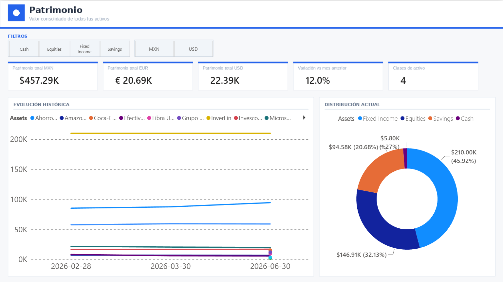
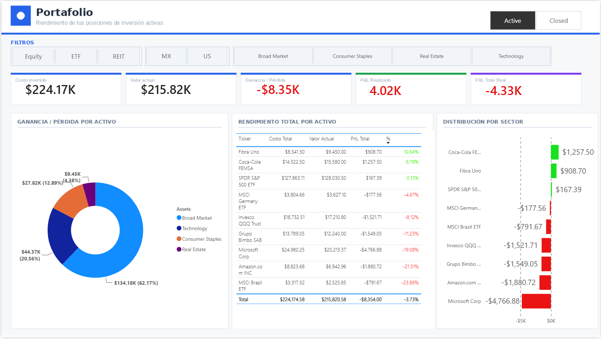
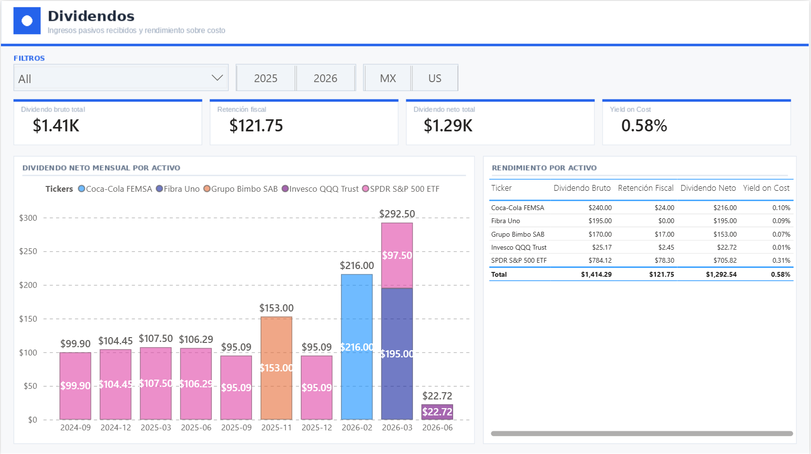
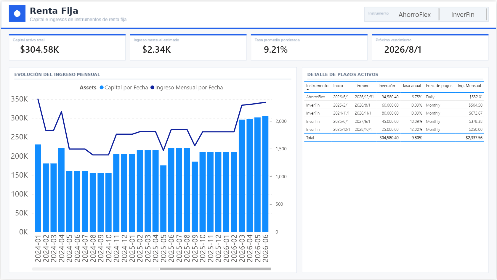
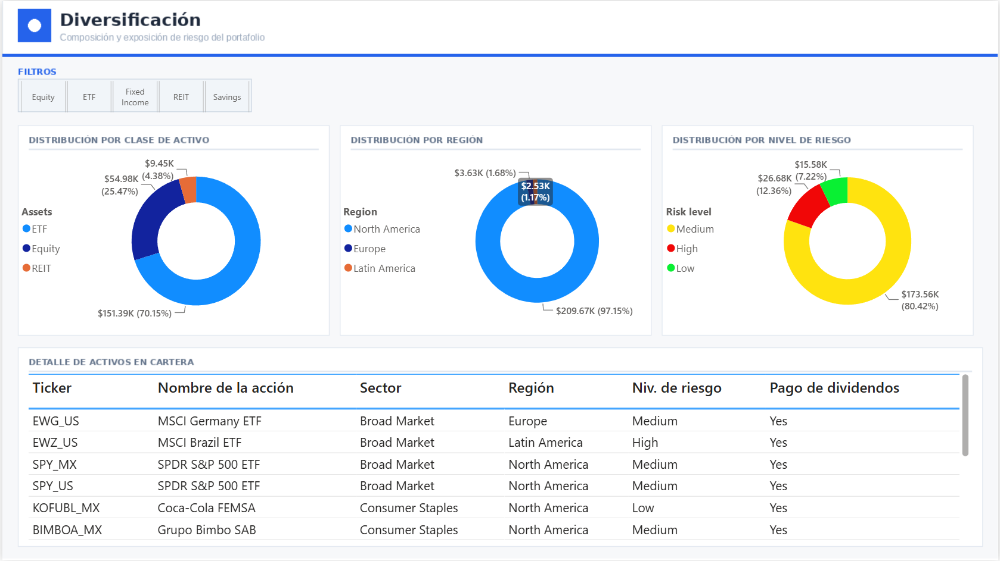
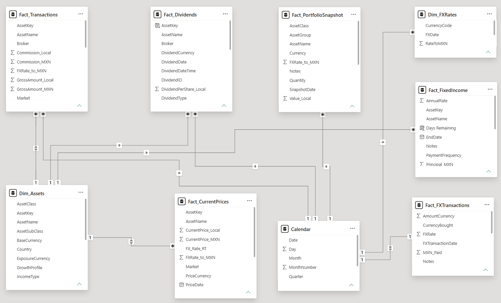
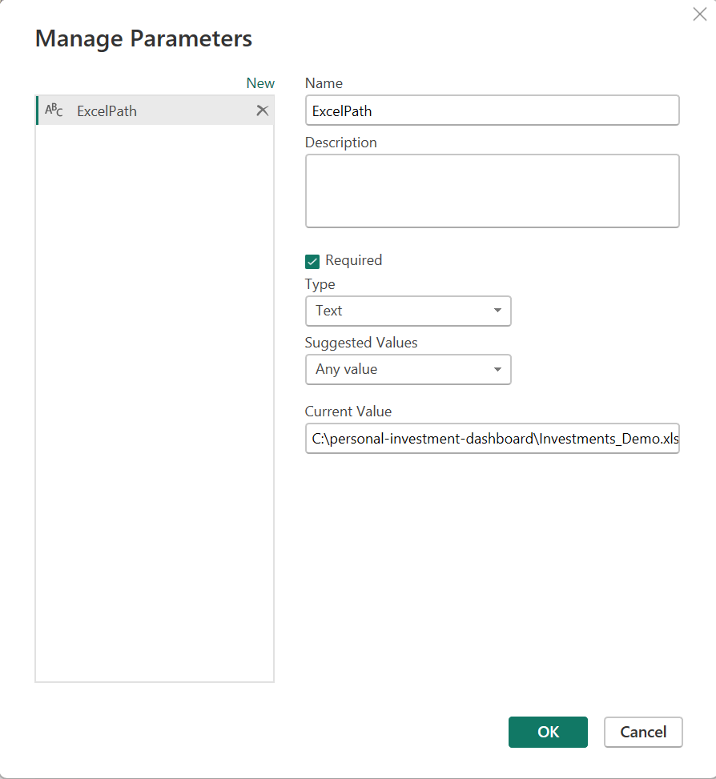
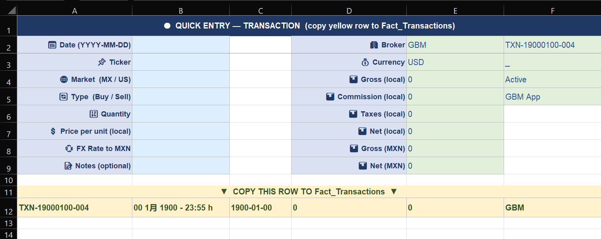

# Personal Investment Dashboard

A multi-currency, multi-market investment tracker built with **Excel** (data model) and **Power BI** (dashboards). Designed to answer the questions that brokerage apps don't: What is my total net worth today? How much passive income am I generating? And are my stock losses really as bad as they look once you account for dividends and fixed income?

---

## What This Project Does

Most investors hold assets across multiple platforms, currencies, and instrument types — and most apps only show you one piece at a time. This dashboard consolidates everything into five pages:

| Page | Question it answers |
|---|---|
| **Patrimonio** | What is my total net worth across all asset types? |
| **Portafolio** | How are my stock positions performing, including closed trades? |
| **Dividendos** | How much dividend income am I receiving, and how much goes to taxes? |
| **Renta Fija** | How much am I earning from fixed-income instruments, and how has that changed over time? |
| **Diversificación** | Am I too concentrated in one sector, region, or risk level? |

---

## Screenshots

### Patrimonio — Total Net Worth


### Portafolio — Stock Performance


### Dividendos — Dividend Income


### Renta Fija — Fixed Income


### Diversificación — Portfolio Composition


### Data Model


---

## Data Model

The Excel workbook (`Investments_Demo.xlsx`) contains these tables:

```
Fact_Transactions      — Every buy and sell, with price, FX rate, commissions, taxes
Fact_Dividends         — Dividend income with gross amount, withholding tax, net received
Fact_FixedIncome       — Fixed-rate instruments with start/end dates, principal, annual rate
Fact_CurrentPrices     — Current market price for each active position
Fact_PortfolioSnapshot — Monthly snapshot of total portfolio value by asset group
Fact_FXTransactions    — Currency purchases (USD, EUR, etc.)
Dim_Assets             — Asset metadata: sector, region, risk level, dividend frequency
Dim_FXRates            — Historical exchange rates by month
```

Each transaction stores the FX rate at the time of the operation, so the cost basis in MXN is always historically accurate — not recalculated at today's rate.

---

## Key DAX Patterns

### Avoiding filter context errors between tables
When calculating the current value of a position, you can't compare columns from two different tables inside a `FILTER`. The fix is to use `VAR` to capture the asset name as a scalar first:

```dax
Valor Actual MXN =
SUMX(
    VALUES(Fact_Transactions[AssetName]),
    VAR activo = Fact_Transactions[AssetName]
    VAR shares = CALCULATE(
        SUM(Fact_Transactions[Quantity]),
        Fact_Transactions[TransactionType] = "Buy",
        Fact_Transactions[Status] = "Active"
    )
    VAR precio = CALCULATE(
        MAX(Fact_CurrentPrices[CurrentPrice_MXN]),
        Fact_CurrentPrices[AssetName] = activo,
        Fact_CurrentPrices[Status] = "Active"
    )
    RETURN shares * precio
)
```

### Historical fixed income — ALLSELECTED vs ALL
To show estimated monthly income across all historical periods while still respecting slicer selections:

```dax
Ingreso Mensual por Fecha =
SUMX(
    FILTER(
        ALLSELECTED(Fact_FixedIncome),
        Fact_FixedIncome[StartDate] <= MAX('Calendar'[Date]) &&
        Fact_FixedIncome[EndDate] >= MIN('Calendar'[Date])
    ),
    Fact_FixedIncome[Principal_MXN] * Fact_FixedIncome[AnnualRate] / 12
)
```

`ALLSELECTED` removes automatic context filters but keeps slicer selections — so the chart shows the full date range while still responding to the instrument filter.

### Separating realized vs unrealized P&L
Active positions use current market price. Closed positions use the actual sale price:

```dax
Valor Actual MXN =
SUMX(
    VALUES(Fact_Transactions[AssetName]),
    VAR activo = Fact_Transactions[AssetName]
    VAR esClosed =
        CALCULATE(
            COUNTROWS(Fact_Transactions),
            Fact_Transactions[TransactionType] = "Sell",
            Fact_Transactions[Status] = "Closed"
        ) > 0
    VAR valorVenta =
        CALCULATE(
            SUM(Fact_Transactions[NetAmount_MXN]),
            Fact_Transactions[TransactionType] = "Sell",
            Fact_Transactions[Status] = "Closed"
        )
    VAR shares = CALCULATE(SUM(Fact_Transactions[Quantity]),
        Fact_Transactions[TransactionType] = "Buy")
    VAR precio = CALCULATE(
        MAX(Fact_CurrentPrices[CurrentPrice_MXN]),
        Fact_CurrentPrices[AssetName] = activo,
        Fact_CurrentPrices[Status] = "Active"
    )
    RETURN IF(esClosed, valorVenta, shares * precio)
)
```

---

## Multi-Currency Design

This dashboard tracks assets in MXN, USD, EUR, and GBP. The approach:

- Every transaction stores the FX rate at the time of purchase (`FXRate_to_MXN`)
- Cost basis in MXN reflects historical rates — not today's
- The Patrimonio page shows totals in MXN, USD, and EUR using the most recent rate from `Fact_PortfolioSnapshot`
- Some ETFs trade on both the Mexican market (MXN) and US market (USD) as separate positions — handled with an `AssetKey` column that uniquely identifies each combination (e.g., `VOO_MX` vs `VOO_US`)

### Converting totals to USD and EUR

A card showing the total net worth in USD or EUR sounds simple — but it breaks the moment a slicer filters out assets denominated in those currencies. If no EUR asset is in the current view, the measure can't find an EUR exchange rate and returns blank.

The first attempt used `ALL()` and `CALCULATE` to force the rate lookup:

```dax
-- ❌ Works sometimes, but breaks with certain slicer combinations
Patrimonio Total EUR =
VAR ultimaFecha =
    CALCULATE(
        MAX(Fact_PortfolioSnapshot[SnapshotDate]),
        ALL(Fact_PortfolioSnapshot)
    )
VAR fx =
    CALCULATE(
        AVERAGE(Fact_PortfolioSnapshot[FXRate_to_MXN]),
        ALL(Fact_PortfolioSnapshot),
        Fact_PortfolioSnapshot[Currency] = "EUR",
        Fact_PortfolioSnapshot[SnapshotDate] = ultimaFecha
    )
RETURN DIVIDE([Snapshot Último Mes], fx)
```

The cleaner solution was to store the exchange rate lookup as a simple measure in `Dim_FXRates`, which sits completely outside the slicer context:

```dax
-- ✅ In Dim_FXRates — always finds the rate regardless of active filters
EUR Rate =
CALCULATE(
    MAX(Dim_FXRates[RateToMXN]),
    Dim_FXRates[CurrencyCode] = "EUR"
)

USD Rate =
CALCULATE(
    MAX(Dim_FXRates[RateToMXN]),
    Dim_FXRates[CurrencyCode] = "USD"
)
```

Then the conversion measures become trivial:

```dax
Patrimonio Total EUR = DIVIDE([Snapshot Último Mes], [EUR Rate])
Patrimonio Total USD = DIVIDE([Snapshot Último Mes], [USD Rate])
```

Because `Dim_FXRates` has no relationship to the slicer tables, its values are never affected by category or currency filters — the rate is always available regardless of what the user has selected.

---

## Tax Handling

The model tracks two types of withholding:

- **Mexican stocks (ISR)**: 10% retained on gross dividend
- **Foreign ETFs via SIC (W-8BEN)**: 10% US withholding on dividends (reduced from 30% with a W-8BEN form on file)
- **FIBRAs** (Mexican REITs): effective rate varies per distribution — must be derived from actual broker figures, as each quarterly payment is split across taxable income, return of capital, etc.

Withholding is stored at the transaction level in `Fact_Dividends`, so the dashboard always shows both gross and net dividend income.

---

## How to Use This

### Requirements
- Microsoft Excel — to fill in your data
- [Power BI Desktop](https://powerbi.microsoft.com/desktop/) (free)

### Option A — Use the demo dashboard (quickest way to explore)

1. Go to the [`downloadable_demo/`](downloadable_demo/) folder and download both files:
   - `Investments_Demo.xlsx` — fictional data, same structure as the real workbook
   - `Dashboard_Demo.pbix` — Power BI file pre-connected to the demo Excel
2. Place both files in the **same folder** on your computer
3. Open `Dashboard_Demo.pbix` in Power BI Desktop
4. Go to **Home → Transform data → Manage Parameters**
5. Update `ExcelPath` with the full path to `Investments_Demo.xlsx` on your machine
   > Example: `C:\Users\YourName\Downloads\personal-investment-dashboard\Investments_Demo.xlsx`
6. Click **Close & Apply** — the dashboard loads with the demo data


### Option B: Do you want to build yours? — Build your own dashboard from scratch

1. Download `Investments_Template.xlsx` from the root of this repository
2. Fill in your own transactions, dividends, and instruments — blue cells are yours to fill, green cells auto-calculate
3. Use the `⚡ Quick Entry` sheet to capture data fast (fewer fields, auto-fills the rest)
4. Open `Dashboard_Demo.pbix`, update `ExcelPath` to point to your template file, and refresh
5. The dashboard will load with your real data


### Adapting the data model to your broker

The template is built around a Mexican broker (GBM) with MX and US markets. If you use a different broker:
- Adjust the commission formula in `Fact_Transactions` — currently `0.25%` of gross amount
- Adjust the tax formula — currently `0.04%` for MX market transactions (ISR)
- Update `Dim_FXRates` with the exchange rates relevant to your currencies

---

## Project Structure

```
├── Investments_Template.xlsx        # Blank template with formulas — fill with your own data
├── downloadable_demo/
│   ├── Investments_Demo.xlsx        # Fictional data, ready to use with the .pbix
│   └── Dashboard_Demo.pbix          # Power BI dashboard pre-connected to the demo Excel
├── backgroundsEN/                   # PNG backgrounds for each dashboard page (1280×720, English)
├── screenshots/                     # Dashboard screenshots
└── README.md
```

---

## Related Article

This project is documented in detail on Medium:
**[How I Built a Personal Investment Dashboard with Excel, Power BI, and a Lot of DAX Headaches](#)**
*(link to be added after publication)*

---

## Notes

- **Demo data**: `Investments_Demo.xlsx` uses fictional tickers, amounts, and dates — the structure is identical to the real workbook but no real financial data is included
- **ExcelPath parameter**: when you first open `Dashboard_Demo.pbix`, Power BI will show a connection error until you update the `ExcelPath` parameter to point to the Excel file on your machine (see Option A, step 4-5)
- **Quick Entry sheet**: the `Quick Entry` tab in both Excel files reduces data capture to 7-8 fields per transaction — the rest auto-calculate. Copy the yellow output row to `Fact_Transactions` or `Fact_Dividends` when done
- **Fixed income**: instruments with a fixed term (SOFIPO, CETES) use explicit start/end dates and annual rates. Digital savings accounts (daily interest, no fixed term) are handled by updating the balance monthly and marking the most recent record as `Active`
- **Calendar table**: generated dynamically in Power BI from the minimum date across all fact tables — it extends automatically as you add historical data. Create it in Power BI via **Modeling → New table** using the DAX formula in the README
- **AssetKey format**: every asset needs a unique key in the format `TICKER_MARKET` (e.g. `VOO_US`, `WALMEX_MX`). This is what links transactions, dividends, and prices across tables
- **Commission and tax logic**: currently set for GBM broker — `0.25%` commission and `0.04%` ISR for MX market transactions. Adjust the formulas in `Fact_Transactions` column `Commission_Local` and `Taxes_Local` if you use a different broker 

---

## Author

**Salvador Jiménez-Juárez**
Mastrère Spécialisé – Digital Strategy Management, Grenoble École de Management (2025)
[LinkedIn](https://linkedin.com/in/salvador-jimenez97mx) · [Medium](https://medium.com/@salvador.jimenez-juarez) · Feel free to open an issue if you have questions about the data model or DAX measures*
